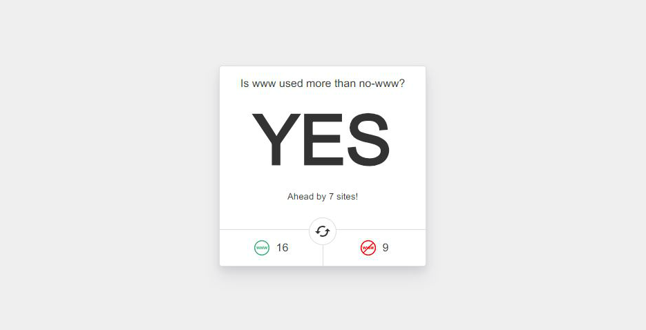

# Is www used more than no-www?

> Just a fun little site to compare the amount of www sites and no-www sites



### Getting Started

To run this locally, clone the repo and use Yarn or NPM to install the dependencies. (You’ll also need Node.js installed)

```bash
git clone https://github.com/h404bi/is-www-used-more-than-no-www
cd is-www-used-more-than-no-www
yarn
```

### Development

Start a dev server on [http://127.0.0.1:8080](http://127.0.0.1:8080)

```bash
yarn dev
```

### Production

To build for prod, run the following:

```bash
yarn build
```
